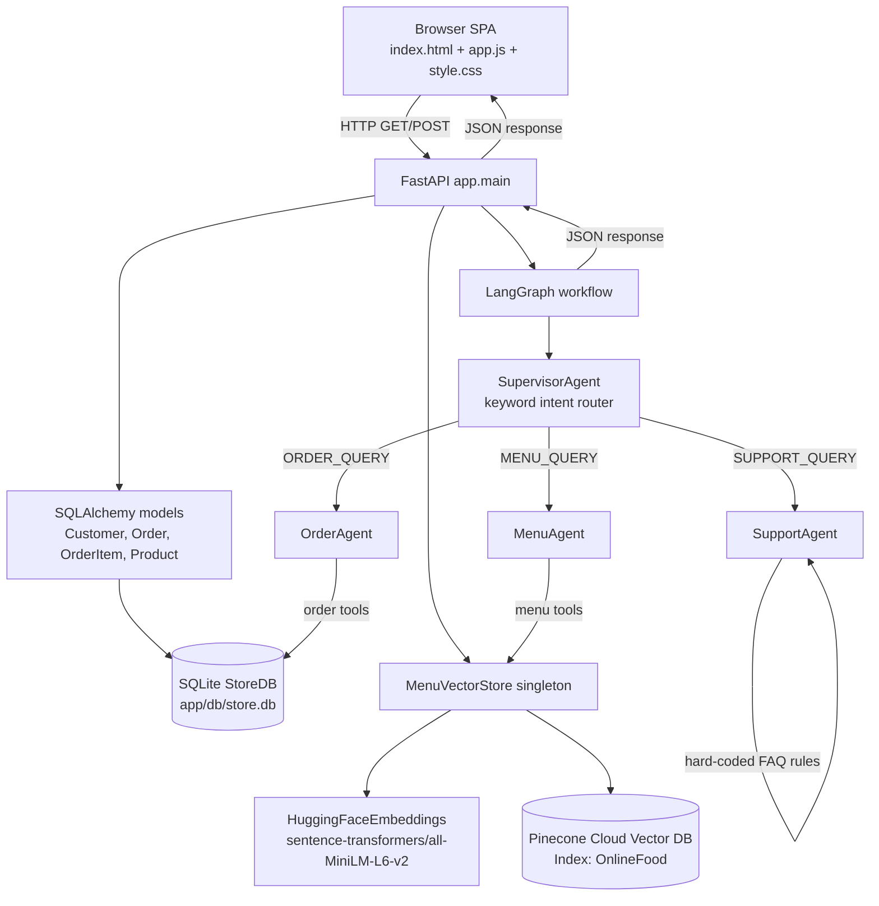
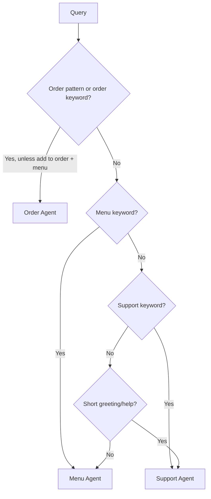

# Tanish Restaurant OnlineFood

Tanish Restaurant is a FastAPI single-page food concierge. The browser provides a chat interface, a StoreDB inspector, a direct menu-vector-search playground, and an agent-architecture view. The backend uses SQLite through SQLAlchemy, a LangGraph supervisor and specialist agents, and a Pinecone Cloud Vector Database (`OnlineFood` index) powered by Hugging Face embeddings (`sentence-transformers/all-MiniLM-L6-v2`).

## Run

```powershell
python -m pip install -r requirements.txt
python run.py
```

Open `http://127.0.0.1:8000`. `run.py` starts Uvicorn with reload enabled. The application serves `app/static/index.html`, `app/static/css/style.css`, and `app/static/js/app.js`.

## System Dataflow



## Application Startup

```mermaid
sequenceDiagram
	participant B as Browser
	participant A as FastAPI startup
	participant D as SQLite StoreDB
	participant V as MenuVectorStore
	participant H as Hugging Face model
	participant P as Pinecone Index (OnlineFood)

	B->>A: GET /
	A-->>B: index.html
	B->>A: DOMContentLoaded -> loadCustomers()
	A->>D: init_db(): create missing tables
	A->>D: If Customer count is zero, seed_database()
	A->>V: get_menu_vector_store()
	V->>P: Check if 'OnlineFood' index exists; create if not present
	V->>D: Read available Product rows
	V->>H: Embed each product search_text
	H-->>V: 384-dimensional vectors
	V->>P: Upsert product vectors with metadata into 'OnlineFood'
	B->>A: GET /api/customers, /api/orders, /api/products
	A-->>B: JSON collections
	B->>B: Populate selector, tables, counts, and customer banner
```

The vector store connects to Pinecone Cloud Vector Database using the `OnlineFood` serverless index. Each product is converted to rich text containing its name, category, price, calories, dietary tags, ingredients, and description. Dense embeddings (384 dimensions) are generated and upserted into Pinecone with full metadata filtering support.

## Every UI Control

### Active Customer selector

The `<select id="customerSelect">` has a `change` listener. It parses the selected customer ID, finds that customer in `state.customers`, updates `state.activeCustomerName`, and calls `updateActiveCustomerBanner()`. This is client-side only: it does not send a request. The selected ID and name are included in the next `/api/chat` request. The banner then finds the first order for that customer whose status is `Pending`, `Preparing`, or `Out for Delivery`; otherwise it displays `No Active Orders`.

### Send button and Enter in the chat input

Submitting `#chatForm` or pressing Enter in the form input triggers the same flow:

```mermaid
sequenceDiagram
	participant U as User
	participant UI as app.js
	participant C as /api/chat
	participant G as LangGraph
	participant S as SupervisorAgent
	participant X as Specialist agent
	participant DB as StoreDB / VectorStore

	U->>UI: Type query and click Send / press Enter
	UI->>UI: trim query; ignore if empty
	UI->>UI: Append user bubble; clear input; show typing indicator
	UI->>C: POST JSON {query, customer_id, customer_name, history}
	C->>C: Reject blank query with HTTP 400
	C->>G: run_multi_agent_chat(...)
	G->>S: supervisor_node(state)
	S->>S: Lowercase query, detect order/menu/support keywords and order pattern
	S-->>G: state.intent, state.next_agent, supervisor trace
	G->>X: Conditional route to one specialist
	X->>DB: Execute StoreDB query or vector search, as applicable
	X-->>G: final_response, active_agent, trace, structured data
	G-->>C: result JSON
	C-->>UI: HTTP 200 response or HTTP 500 detail
	UI->>UI: Remove typing; render Markdown, trace, order card, food cards
	UI->>UI: Save two history entries and refresh orders/products/banner
```

The request history is only browser session state. It starts as `[]`, then receives `{role: "user", content: query}` and `{role: "assistant", content: response}` after each successful response. The current agents do not use history for routing, but it is forwarded in the request and retained for future behavior.

### Quick query prompt chips

Each `.prompt-chip` has a `data-query` value. Clicking one skips the text input, calls `handleSendMessage(data-query)`, and follows the exact Send flow above. The predefined paths are:

| Chip | Query sent | Expected route |
| --- | --- | --- |
| Track order | `Where is my order #ORD-1001?` | Order Agent, explicit order lookup |
| My past orders | `Show my order history and past orders` | Order Agent, customer history |
| Spicy pizza | `Show me spicy pizzas under $18` | Menu Agent, spicy + Pizza + max price |
| Gluten-free and vegetarian | `What gluten-free vegetarian dishes do you have?` | Menu Agent, GF + vegetarian |
| Dessert and drink | `Suggest a sweet dessert and a refreshing drink` | Menu Agent, semantic search; category detection uses the first matching category |
| Store hours | `What are your store hours and delivery policies?` | Support Agent, hours branch takes precedence |

### Food-card Details buttons

Successful menu chat responses can include up to three food cards. Each dynamically-created `.btn-ask-food` button reads its card's item name and sends `Tell me more about <item> and ingredients` through `handleSendMessage()`. That creates a new chat request, normally routed to Menu Agent's specific-item-details branch. It first tries a case-insensitive substring name lookup, then falls back to one vector result, and returns ingredients, dietary tags, calories, price, and description.

### Main tabs

The three `.tab-btn` controls (`StoreDB Live`, `Vector DB Search`, and `Agent Architecture`) only change the DOM. Their click listener removes `active` from all tab buttons and panes, reads `data-tab`, and adds `active` to the matching pane. No API request is made.

### StoreDB subtabs

The `Orders`, `Products`, and `Customers` `.subtab-btn` controls also only change the DOM. Their listener toggles active classes using `data-subtab`; it does not reload data. The displayed tables were last populated by startup, Refresh DB, or the post-chat refresh.

### Refresh DB View button

Clicking `#btnRefreshDb` adds a spinning CSS class, calls `loadStoreDbData()`, then removes the class. `loadStoreDbData()` performs two independent GET requests:

1. `GET /api/orders` reads all orders, including order items, sorts by newest `created_at`, updates the order count, and renders the Orders table.
2. `GET /api/products` reads all products, updates the product count, and renders the Products table.

The customer table is not reloaded by this button. Network errors are logged to the browser console.

### Reset DB button

Clicking `#btnResetDb` first opens a browser confirmation dialog. Cancel stops immediately. Confirm sends `POST /api/db/reset`. The server calls `seed_database()`, which clears existing order items, orders, products, and customers when records already exist, inserts the seed data, then calls `get_menu_vector_store().sync_with_db()` to rebuild the in-memory product index and embeddings. The response is an alert. On success the browser reloads customers, orders, products, and the active-customer banner. On failure it displays an alert with the error message.

### Vector Search button and Enter in vector search

Clicking `#btnVectorSearch` or pressing Enter in `#vectorSearchInput` calls `performVectorSearch()`. Empty queries return without a request. Otherwise the UI shows a loading state and sends:

```text
GET /api/menu/search?query=<text>
```

The optional checked filters append `is_vegetarian=true`, `is_gluten_free=true`, and/or `is_spicy=true`. A selected category appends `category=<category>`. The UI does not send a `max_price` value from this playground, although the endpoint accepts one. The response renders each result's product name, description, category, price, and similarity percentage. Zero matches render an empty state; a network error renders the exception message.

### Vector filter checkboxes and category selector

The Vegetarian, Gluten-Free, Spicy checkboxes and category `<select>` have no individual change listeners. They only change DOM state. Their values are read the next time Search or Enter triggers `performVectorSearch()`.

## Chat Routing Details



The supervisor is deterministic, not an LLM call. Order indicators include `order`, `ORD-`, `#`, `tracking`, `track`, delivery status, `where is my`, ETA, receipt, driver, and ordered. Menu indicators include food categories, dietary terms, ingredients, recommendations, price, and availability. Support indicators include hours, refund, cancel, payment, contact, help, and greetings. Order detection is evaluated first, then menu, then support.

### Order Agent dataflow

The Order Agent chooses one path:

- An order reference such as `ORD-1001`, `#1001`, or `order 1001` calls `get_order_by_number()`. It normalizes numeric IDs to `ORD-<number>`, queries `Order` by order number or numeric ID, and serializes the order with customer and item details.
- A query containing `past orders`, `all orders`, `order history`, `previous orders`, `my orders`, or `what have i ordered` calls `get_customer_orders()` using the selected customer ID/name. It queries `Customer`, then all matching `Order` rows with items, newest first.
- All other order queries call `get_latest_active_order()`. It searches the selected customer for the newest `Pending`, `Preparing`, or `Out for Delivery` order. If none exists, it falls back to the newest order of any status.

The result becomes Markdown in `final_response` and structured `order_data` in the JSON response. The browser uses `order_data` to create a status progress card.

### Menu Agent dataflow

The Menu Agent extracts dietary flags and a price ceiling from natural language, detects the first matching category, then chooses one path:

- Specific detail terms (`ingredients`, `calories`, `what is in`, `tell me about`, or `describe`) call `get_item_details()`, unless the query also asks for a menu, recommendations, or options.
- Category overview terms (`what categories`, `what do you have`, `show categories`, or `view menu categories`) call `get_all_categories()` from the indexed documents.
- Otherwise `search_menu_items()` calls `MenuVectorStore.search()` with up to four results and the extracted filters.

For semantic search, the query is embedded with Hugging Face, normalized, dot-multiplied against normalized product vectors, filtered by category/diet/price, sorted descending, and returned with similarity scores. `min_similarity` exists in the method signature but is not currently applied, so filtered results are not removed by a score threshold. Menu results become both Markdown and `menu_matches`; the browser renders up to three food cards.

### Support Agent dataflow

Support responses are local rule-based strings. It checks hours first, then delivery, then cancellation/refund, then payments, and otherwise returns the general help response. It does not query SQLite, call an external model, or mutate data.

## API Contract

| Endpoint | Trigger | Server work | Response used by |
| --- | --- | --- | --- |
| `GET /` | Browser page load | Serves `index.html` | Browser |
| `GET /api/customers` | Startup, customer reload, reset | Query all `Customer` rows and serialize them | Selector, customer table, banner |
| `GET /api/orders` | Startup, Refresh DB, post-chat refresh | Query all `Order` rows with items, newest first | Orders table, banner |
| `GET /api/products` | Startup, Refresh DB, post-chat refresh | Query all `Product` rows | Products table |
| `GET /api/menu/search` | Vector Search or Enter | Search the vector store with query and optional filters | Vector results panel |
| `POST /api/chat` | Send, prompt chip, food Details | Invoke LangGraph and return response/trace/data | Chat transcript and cards |
| `POST /api/db/reset` | Confirmed Reset DB click | Reseed SQLite and re-index vector store | Alert, then all browser data views |

All successful chat responses have this shape:

```json
{
  "response": "Markdown text",
  "active_agent": "Order Agent | Menu Agent | Support Agent",
  "intent": "ORDER_QUERY | MENU_QUERY | SUPPORT_QUERY",
  "agent_trace": [],
  "order_data": null,
  "menu_matches": null
}
```

## Error and Empty-State Behavior

- Blank chat input is ignored in the browser; the API independently returns HTTP 400 for a blank payload.
- Chat HTTP errors remove the typing indicator and render the server's `detail`. Network failures render a connection error.
- Customer, order, and product loading failures are logged to the console and may leave the previous/empty view visible.
- Vector search with no matches shows an empty state. Vector network failures show the error text in the results area.
- Missing orders, customers, or products are converted into agent prose or table empty states rather than crashing the normal UI.
- If Pinecone API key is not configured or offline, a clear warning is logged and cached vectors can be queried. The model may download weights from Hugging Face on first startup; an unauthenticated Hugging Face environment can show a rate-limit warning.

## Important Implementation Notes

- `app.main.on_startup()` initializes the database and vector store before normal requests.
- `get_menu_vector_store()` returns one process-local singleton. Uvicorn reloads or multiple worker processes create separate instances.
- The UI refreshes orders and products after every successful chat even though most chat requests do not mutate the database.
- The current application has no button that creates an order, changes order status, or performs payment. Chat is read-oriented for order and menu information.
- The browser uses `marked.parse()` for assistant Markdown and explicit HTML escaping for user/product text in most generated elements.
- `max_price` is supported by the API and Menu Agent natural-language parsing, but there is no max-price control in the direct vector-search panel.
